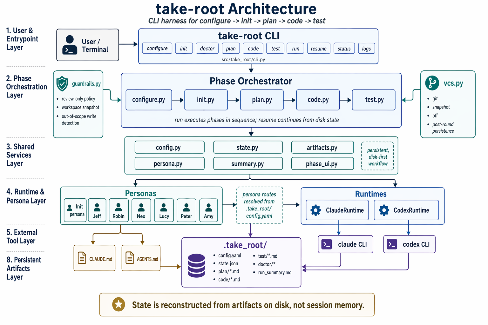

# 🌱 take-root

<p align="center">
  <strong>Python CLI harness Agent: six personas collaborate to drive ideas through planning, implementation, and testing</strong>
</p>

<p align="center">
  <a href="https://www.python.org/"></a>
  <a href="LICENSE"></a>
  
  
</p>

`take-root` is a Python CLI harness Agent that drives ideas through planning, implementation, and testing using six personas: Jeff / Robin / Neo / Lucy / Peter / Amy.

[Installation](#installation) · [Minimal Usage](#minimal-usage) · [Architecture](#architecture) · [Workflow](#workflow-diagram) · [Collaboration](#architecture-diagram) · [Subcommands](#common-subcommands) · [Dev Checks](#development-checks) · [WeChat](#wechat)

## Architecture

<p align="center">
  
</p>

## Installation

```bash
cd /home/robin/Projects/take_root
python3.11 -m pip install -e .
```

## Minimal Usage

```bash
cd /path/to/your/project
take-root configure
take-root init
take-root run
take-root status
```

## Workflow Diagram

```text
+--------------------+
| Start take-root    |
+---------+----------+
          |
          v
+-------------------------------+
| configure                     |
| Set up providers / models /   |
| persona routes                |
+---------+---------------------+
          |
          v
+-------------------------------+
| init                          |
| Generate CLAUDE.md / AGENTS.md|
+---------+---------------------+
          |
          v
+-------------------------------------------------------------------+
| run                                                                |
| Execute plan -> code -> test in sequence                          |
| Default checkpoint between phases: Y / n / save-and-exit          |
+---------+---------------------------------------------------------+
          |
          | save-and-exit
          v
+-------------------------------+         +-------------------------+
| Save .take_root/state.json    | ------> | resume                  |
| and exit                      |         | Continue from current   |
+-------------------------------+         | phase                   |
                                          +------------+------------+
                                                       |
                                                       v
+-------------------------------+         +-------------------------+
| plan                          | <-------+ if current_phase=plan   |
| Jeff interactive proposal     |         +-------------------------+
|   -> Robin review-only        |
|   -> Neo review-only          |
|   -> Robin outputs final_plan |
+---------+---------------------+
          |
          v
+-------------------------------+         +-------------------------+
| code                          | <-------+ if current_phase=code   |
| Lucy implements               |         +-------------------------+
|   -> Peter review-only        |
| Loop until converged or budget|
| exhausted                     |
+---------+---------------------+
          |
          v
+---------------------------------------------------+
| code outcome branches                             |
| 1. converged       -> advance to test             |
| 2. exhausted_stop  -> stay at code, show next_action|
| 3. exhausted_advance -> advance to test with risk |
+---------+-----------------------------------------+
          |
          v
+-------------------------------+         +-------------------------+
| test                          | <-------+ if current_phase=test   |
| Amy runs full test suite      |         +-------------------------+
|   -> all_pass: done           |
|   -> fail: Lucy fixes, retry  |
+---------+---------------------+
          |
          v
+-------------------------------+
| done                          |
| All tests pass, workflow done |
+-------------------------------+
```

Notes:

- `run` will automatically run `init` if it has not been done, but will **not** automatically run `configure`.
- Jeff in `plan` is interactive; Robin and Neo are non-interactive and review-only.
- `code` stays at `code` by default when budget is exhausted; pass `--on-code-exhausted advance` explicitly to advance to `test`.
- `resume` ignores any CLI flags from your previous invocation and resumes with built-in defaults.

## Architecture Diagram

```text
+------------------------------+
| User                         |
| Issues commands via CLI      |
+--------------+---------------+
               |
               v
+---------------------------------------------------------------+
| CLI Layer                                                     |
| cli.py                                                        |
| configure / init / doctor / plan / code / test / run / resume |
+--------------+------------------------------------------------+
               |
               v
+---------------------------------------------------------------+
| Phase Orchestrator                                            |
| phases/configure.py                                           |
| phases/init.py                                                |
| phases/plan.py                                                |
| phases/code.py                                                |
| phases/test.py                                                |
+------+----------------------+--------------------+------------+
       |                      |                    |
       | read/update          | build boot message | invoke runtime
       v                      v                    v
+-------------+   +---------------------------+   +--------------------+
| config.yaml |   | persona / frontmatter     |   | runtimes/          |
| provider    |   | load persona definitions  |   | claude.py          |
| / model     |   | and constraints           |   | codex.py           |
| routing     |   +---------------------------+   +---------+----------+
+------+------+                                             |
       |                                                    v
       |                                  +----------------------------------+
       |                                  | External models / CLIs           |
       |                                  | Claude / Codex / compatible      |
       |                                  | providers                        |
       |                                  +----------------+-----------------+
       |                                                   |
       |                                                   v
       |                             +----------------------------------------+
       |                             | Persona Collaboration Layer            |
       |                             | init  : project recon, gen CLAUDE.md   |
       |                             | Jeff  : interactive proposal           |
       |                             | Robin : review / finalize              |
       |                             | Neo   : adversarial review             |
       |                             | Lucy  : implement / fix                |
       |                             | Peter : code review                    |
       |                             | Amy   : full test                      |
       |                             +----------------+-----------------------+
       |                                              |
       +----------------------------------------------+
                                                      |
                                                      v
+--------------------------------------------------------------------------------+
| State & Artifact Layer                                                         |
| .take_root/state.json                                                          |
| .take_root/plan/*.md                                                           |
| .take_root/code/*.md                                                           |
| .take_root/test/*.md                                                           |
| .take_root/run_summary.md                                                      |
| CLAUDE.md / AGENTS.md                                                          |
+-----------------------------+--------------------------------------------------+
                              |
                              v
+--------------------------------------------------------------------------------+
| Constraint & Recovery Layer                                                    |
| state.py: reconcile_state_from_disk() restores current_phase from disk         |
| guardrails.py: plan review-only snapshots, out-of-scope write detection        |
| summary.py: generates next_action / overview                                   |
| vcs.py: git / snapshot / off                                                   |
+--------------------------------------------------------------------------------+
```

Notes:

- The CLI is just the entry point; real orchestration happens in `phases/*.py`.
- Robin and Neo in the `plan` phase are constrained by a review-only policy and can only write their own artifacts.
- All phases recover from disk artifacts and `state.json`, not from session memory.
- `run_summary.md`, `status`, and `resume` all operate against the same state model.

## Common Subcommands

- `take-root plan --reference <file>`: Run only the plan phase.
- `take-root code --vcs auto --on-code-exhausted stop|advance`: Run only the code phase. Stays at `code` by default when budget is exhausted without convergence; pass `advance` to allow risky advancement to `test`.
- `take-root test --max-iterations 5`: Run only the test phase.
- `take-root run --on-code-exhausted stop|advance`: Run multiple phases in sequence, honouring the same code handoff rules.
- `take-root resume`: Continue from `.take_root/state.json`. If `code` is in `exhausted_stop`, only the recommended next action is shown — it will not automatically re-run or advance.
- `take-root reset`: Roll back to the start of `plan`, clear workflow artifacts (backup first to `.take_root/trash/<timestamp>/`).
- `take-root reset --to code|test`: Roll back only the specified phase and later phases, keeping earlier artifacts.
- `take-root reset --all`: Full wipe of config and context (also backed up to `.take_root/trash/<timestamp>/`).
- `take-root logs [plan|code|test] --round N`: Inspect artifacts for a given round.

## Run Summary

- After each successful `plan`, `code`, or `test` run, `.take_root/run_summary.md` is overwritten.
- `take-root status` and `run_summary.md` share the same summary view, both showing the current conclusion, stop reason, and next command to run.

## Development Checks

```bash
pytest
python3.11 -m mypy --strict src/take_root
ruff check .
ruff format --check .
```

## WeChat

<p align="center">
  
</p>
